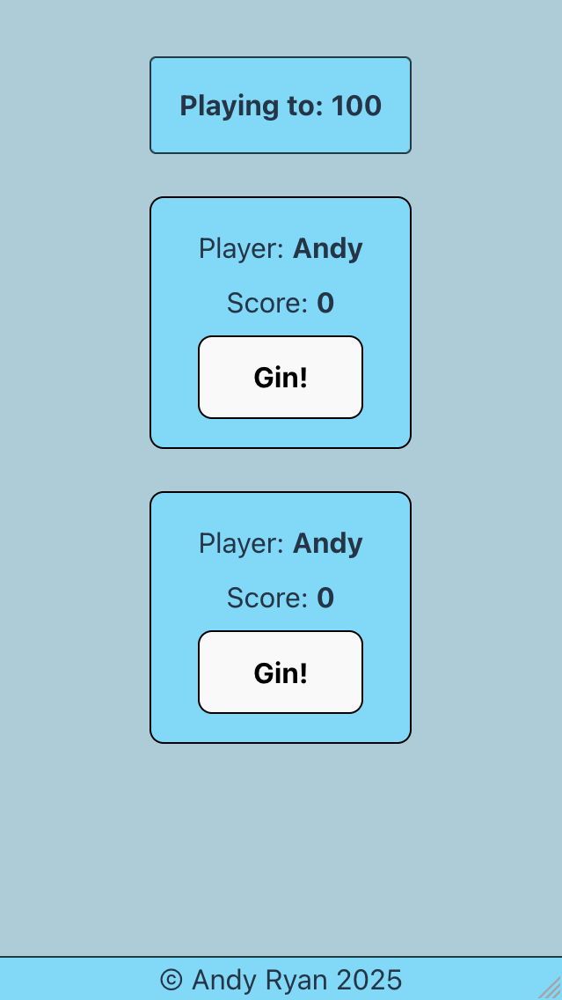

# Gin Rummy Score Tracker

## Table of Contents

- [Description](#description)
- [Usage and Screenshots](#usage-and-screenshots)
- [Technologies Used](#technologies-used)
- [Dependencies and Credits](#dependencies-and-credits)
- [Project Structure](#project-structure)

## Description

I built this to fulfill a need for easier score tracking than writing on a napkin or using a spreadsheet

## Usage and Screenshots

<div><span> </span></div>

On the main page type in the two player names and then select the score that you will play to (recommended to start with 100). Once a player gets gin, click the "Gin!" button then enter their extra points from the opponent's hand. Once a player has enough points to win you will be brought back to the starting screen with a message of which player won. You can now start a new game if you'd like.

- [Link to live preview](https://gin-rummy-score-tracker.pages.dev/)

### Features

- Simple and lightweight
- Stores scores in state
- Resets scores when the game is over

### Future improvement ideas

- Convert to a React Native app for offline use
- Make a dedicated winner page

## Technologies Used

### Frontend

- <a href="https://vite.dev/"> Vite </a>
- <a href="https://react.dev/"> React</a>
- <a href="https://developer.mozilla.org/en-US/docs/Web/JavaScript"> JavaScript</a>
- <a href="https://developer.mozilla.org/en-US/docs/Web/HTML"> HTML</a>
- <a href="https://developer.mozilla.org/en-US/docs/Web/CSS"> CSS</a>

### Development Tools

- <a href="https://code.visualstudio.com/"> VS Code</a>
- <a href="https://www.npmjs.com/"> NPM</a>
- <a href="https://git-scm.com/"> Git</a>

### Hosting

- <a href="https://www.cloudflare.com/"> Cloudflare</a>
- <a href="https://github.com/"> Github</a>

## Dependencies and Credits

### Package Dependencies

- [@eslint/js](https://www.npmjs.com/package/@eslint/js)
- [@types/react](https://www.npmjs.com/package/@types/react)
- [@types/react-dom](https://www.npmjs.com/package/@types/react-dom)
- [@vitejs/plugin-react](https://www.npmjs.com/package/@vitejs/plugin-react)
- [eslint](https://www.npmjs.com/package/eslint)
- [eslint-config-prettier](https://www.npmjs.com/package/eslint-config-prettier)
- [eslint-plugin-react-hooks](https://www.npmjs.com/package/eslint-plugin-react-hooks)
- [eslint-plugin-react-refresh](https://www.npmjs.com/package/eslint-plugin-react-refresh)
- [globals](https://www.npmjs.com/package/globals)
- [react-dom](https://www.npmjs.com/package/react-dom)

### Other Credits

- [Devicion](https://devicon.dev/)
- [Skillicons](https://skillicons.dev/)


## Project Structure

```bash
├──public/                 # Locally stored images are here
└──src/                    # React components are here
```
